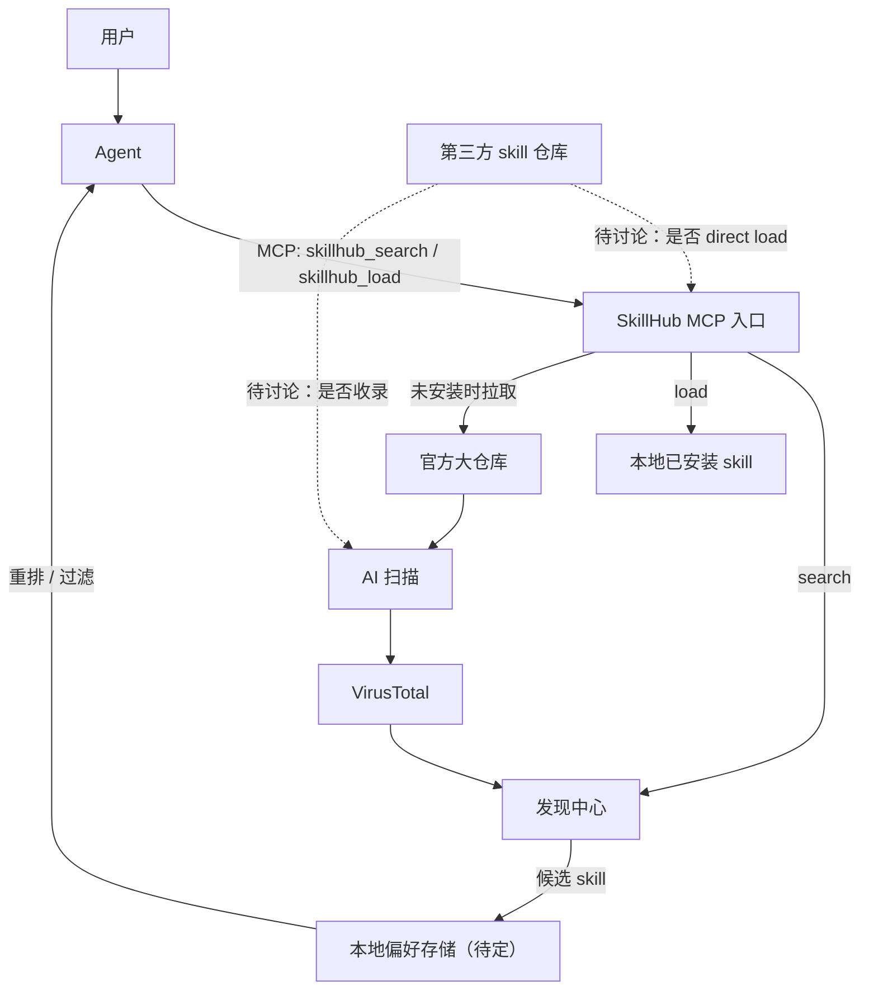
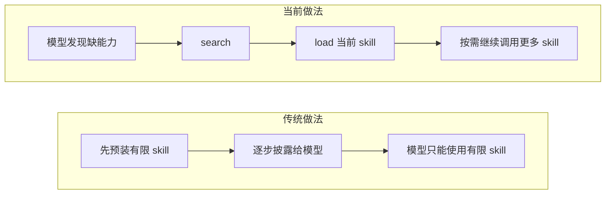
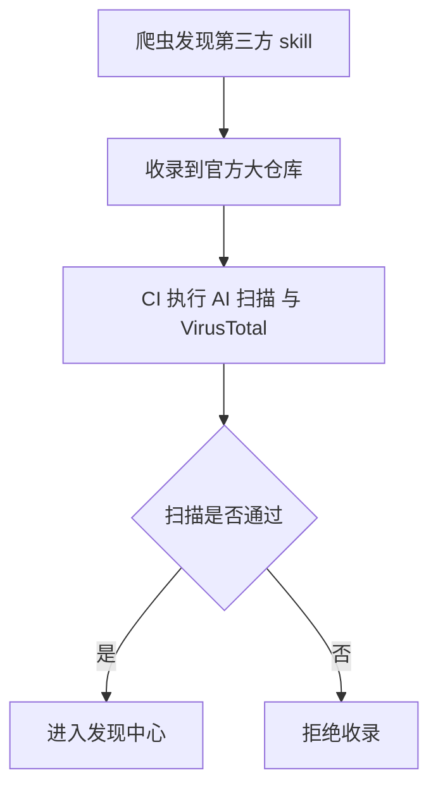
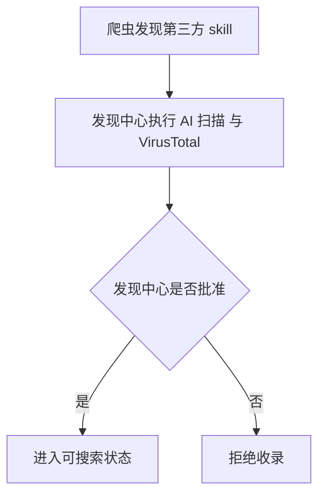

# SkillHub 设计文档

## 1. 范围

本文档定义：
- `SKILL.md` 结构
- `skillhub_search` / `skillhub_load` 接口
- `dependencies.tools` / `dependencies.skills`
- `id` 与版本规则
- 本地安装目录与安装流程
- 当前安全扫描方案

本文档暂不定义：
- Discovery Index 收录归属与批准流程
- 缓存实现细节
- 数据库表结构
- 内部模块拆分
- lockfile

### 1.1 基础产品形态



### 1.2 与传统做法的区别

- 当前做法：模型缺能力时再 `search` / `load`
- 传统做法：先预装一批有限 skill，再逐步披露



## 2. 核心概念

`id`
- skill 标识
- root skill 的 `id` 同时承担版本解析、安装和外部依赖单位
- sub skill 的 `id = 父 root skill 的 id + "/" + 相对路径`
- sub skill 可以不在 `SKILL.md` 中显式写 `id`

`name`
- 展示名

`dependencies.tools`
- 命令依赖
- 例如：`ffmpeg`、`yt-dlp`、`rg`

`dependencies.skills`
- 外部 root skill 依赖
- 写法：`{{id}}@{{version}}`
- `version` 表示最小要求版本

`skills`
- 本地子 skill 暴露列表
- 目录规则：`skills/{{name}}/SKILL.md`
- 该字段不参与 root skill 识别

返回给模型时：
- SkillHub 会在 `sub_skills` 中返回子 skill 的完整 `id`
- 因此 sub skill 即使不显式写 `id`，模型也能继续加载

## 3. `SKILL.md` 结构

### 3.1 目录结构

```text
publish-post/
  SKILL.md
  skills/
    draft-post/
      SKILL.md
    publish-final/
      SKILL.md
```

### 3.2 根 Skill 示例

```md
---
id: github.com/acme/clawhub/social/publish-post
name: 发布小红书图文
description: 发布小红书图文内容
tags:
  - social
  - xiaohongshu
  - publish

dependencies:
  tools:
    - ffmpeg
    - yt-dlp
  skills:
    - github.com/acme/clawhub/common/image-tools@v1.2.0
    - github.com/acme/clawhub/common/uploader@v2.1.0

skills:
  - draft-post
  - publish-final
---

# Publish Post
```

### 3.3 子 Skill 示例

```md
---
name: 生成小红书图文草稿
description: 根据用户素材生成一版草稿
tags:
  - social
  - writing

dependencies:
  tools: []
  skills: []

skills: []
---

# Draft Post
```

sub skill 默认 `id` 推导示例：
- 父 skill `id`：`github.com/acme/clawhub/social/publish-post`
- 文件路径：`skills/draft-post/SKILL.md`
- 默认 `id`：`github.com/acme/clawhub/social/publish-post/draft-post`

### 3.4 字段规则

`id`
- 只在 root skill 中显式写出
- 普通单仓库 skill 可以缺省
- 缺省仅适用于：仓库根目录下只有一个 root `SKILL.md`
- 缺省时退化为：`github.com/{owner}/{repo}`
- ClawHub 这类大仓库中的 root skill 必须显式写 `id`

`skills`
- 不强制要求
- 缺省时，默认暴露当前目录下 `skills/` 中的所有直接子 skill
- 存在时，只暴露其中列出的子 skill，并按声明顺序返回

## 4. 外部接口

```go
type SearchRequest struct {
	ID          string `json:"id,omitempty"`
	Description string `json:"description,omitempty"`
	Tag         string `json:"tag,omitempty"`
	Limit       int    `json:"limit,omitempty"`
}

type LoadRequest struct {
	ID      string `json:"id"`
	Version string `json:"version,omitempty"`
}

type SkillSummary struct {
	ID          string   `json:"id"`
	Name        string   `json:"name,omitempty"`
	Description string   `json:"description"`
	Version     string   `json:"version,omitempty"`
	Tags        []string `json:"tags,omitempty"`
}

type SkillDeps struct {
	Skills []SkillSummary `json:"skills,omitempty"`
	Tools  []string       `json:"tools,omitempty"`
}

type Skill struct {
	ID        string         `json:"id"`
	Name      string         `json:"name,omitempty"`
	Version   string         `json:"version"`
	Body      string         `json:"body"`
	SubSkills []SkillSummary `json:"sub_skills,omitempty"`
	Deps      SkillDeps      `json:"deps,omitempty"`
}

type SkillHubTools interface {
	Search(req SearchRequest) ([]SkillSummary, error)
	Load(req LoadRequest) (*Skill, error)
}
```

### 4.1 `skillhub_search`

- `id`、`description`、`tag` 可为空
- 三个查询字段至少一个非空
- `description` / `tag` 按正则匹配
- `id` 按 root skill 路径精确或前缀匹配
- 只返回 root skill 摘要

### 4.2 `skillhub_load`

- root skill：`id = root skill 路径`
- sub skill：`id = root skill 路径 + "/" + 相对路径`
- 返回当前 skill 的正文、`sub_skills`、`deps.skills`、`deps.tools`
- `deps` 返回当前 skill 自己声明的依赖

### 4.3 MCP 接入

宿主通过 MCP 只需暴露两个 tool：
- `skillhub_search`
- `skillhub_load`

## 5. 完整示例

### 5.1 搜索

输入：

```json
{
  "description": "小红书.*图文.*发布"
}
```

输出：

```json
[
  {
    "id": "github.com/acme/clawhub/social/publish-post",
    "name": "发布小红书图文",
    "description": "发布社交媒体图文内容",
    "version": "v1.4.2",
    "tags": ["social", "publish"]
  }
]
```

### 5.2 加载根 Skill

输入：

```json
{
  "id": "github.com/acme/clawhub/social/publish-post"
}
```

输出：

```json
{
  "id": "github.com/acme/clawhub/social/publish-post",
  "name": "发布小红书图文",
  "version": "v1.4.2",
  "body": "... publish-post 的正文 ...",
  "sub_skills": [
    {
      "id": "github.com/acme/clawhub/social/publish-post/draft-post",
      "name": "生成草稿",
      "description": "生成草稿"
    },
    {
      "id": "github.com/acme/clawhub/social/publish-post/publish-final",
      "name": "执行最终发布",
      "description": "执行最终发布"
    }
  ],
  "deps": {
    "skills": [
      {
        "id": "github.com/acme/clawhub/common/image-tools",
        "name": "图片处理能力",
        "description": "图片处理能力",
        "version": "v1.2.0"
      },
      {
        "id": "github.com/acme/clawhub/common/uploader",
        "name": "上传能力",
        "description": "上传能力",
        "version": "v2.1.0"
      }
    ],
    "tools": [
      "ffmpeg",
      "yt-dlp"
    ]
  }
}
```

### 5.3 加载子 Skill

输入：

```json
{
  "id": "github.com/acme/clawhub/social/publish-post/draft-post",
  "version": "v1.4.2"
}
```

输出：

```json
{
  "id": "github.com/acme/clawhub/social/publish-post/draft-post",
  "name": "生成草稿",
  "version": "v1.4.2",
  "body": "... draft-post 的正文 ...",
  "sub_skills": [],
  "deps": {}
}
```

## 6. 工具依赖处理

SkillHub：
- 返回 `deps.tools`
- 不检查工具是否已安装
- 不负责安装

宿主或主 agent：
- 检查命令是否存在
- 不存在时使用宿主工具链安装
- 安装后继续流程

主 agent 提示词示例：

```text
When `deps.tools` is non-empty, each entry is a required command.

For each tool:
- On macOS, check it with Homebrew first. If missing, run `brew install <tool>`.
- On Debian/Ubuntu, check it with the system package database first. If missing, run `apt install -y <tool>`.
- On Windows, check it with winget first. If missing, run `winget install <tool>`.

After installation, verify that the command is runnable.
If the package manager cannot resolve the tool by the same name, stop and report the unresolved tool. Do not guess alternatives.
```

## 7. `id` 与版本规则

### 7.1 root skill 规则

- root skill 的 `id` 是版本单位、安装单位和外部依赖单位
- ClawHub 这类大仓库中的 root skill：
  - 必须显式写 `id`
  - 例如：`github.com/acme/clawhub/social/publish-post`
  - 不做自动猜测

### 7.2 普通 skill fallback

普通单仓库 skill 指：
- 仓库根目录下只有一个 root `SKILL.md`

这类 skill 可以缺省 `id`。

缺省规则：
1. 如果仓库根目录下只有一个 root `SKILL.md`
2. 且该 skill 没有显式写 `id`
3. 则服务端退化为：

```text
github.com/{owner}/{repo}
```

例如：
- 仓库：`github.com/bob/rednote-skill`
- 根 `SKILL.md` 没写 `id`
- 则默认 `id = github.com/bob/rednote-skill`

不适用 fallback 的情况：
- 仓库里有多个 root `SKILL.md`
- ClawHub 这类大仓库

这些情况都必须显式写 `id`，不做自动猜测。

### 7.3 `id` 规则

- 对外只有一个 `id`
- root skill：`id = root skill 路径`
- sub skill：`id = root skill 路径 + "/" + 相对路径`

### 7.4 版本规则

- 版本号使用 Go 风格写法
- 必须以 `v` 开头
- 支持 pre-release

### 7.5 VCS Tag 规则

- 普通单仓库 root skill：`v1.2.3`
- 大仓库子目录 root skill：`social/publish-post/v1.2.3`

### 7.6 默认版本选择

root skill 未传 `version` 时：
1. 读取当前模块可用 tag
2. 过滤属于当前模块的 tag
3. 按 Go 风格版本规则比较
4. 选择最大版本
5. 如果没有匹配 tag，则退化为当前 root skill 路径对应的 pseudo-version

### 7.7 依赖图求解（MVS）

- `dependencies.skills` 中的版本表示最小要求版本
- MVS 仅作用于 `dependencies.skills`
- 本地 `skills` 不参与 MVS
- 子 skill 不单独选版本，直接继承 root skill 的具体版本
- 对同一个 root skill 的多个要求版本，保留最高要求版本

示例：

```text
root skill 依赖：
- github.com/acme/A@v1.2.0
- github.com/acme/B@v1.2.0

A@v1.2.0 依赖：
- github.com/acme/C@v1.3.0

B@v1.2.0 依赖：
- github.com/acme/C@v1.4.0

MVS 结果：
- A = v1.2.0
- B = v1.2.0
- C = v1.4.0
```

## 8. 本地安装目录与安装流程

### 8.1 本地安装目录

```text
$SKILLHUB_HOME/
  skills/
    github.com/
      acme/
        clawhub/
          social/
            publish-post/
              v1.4.2/
                SKILL.md
                skills/
                  draft-post/
                    SKILL.md
                  publish-final/
                    SKILL.md
```

外部依赖示例：

```text
$SKILLHUB_HOME/skills/github.com/acme/clawhub/common/uploader/v2.1.0/
```

约束：
- 安装单位是 `root skill 的 id@exact_version`
- 子 skill 不单独安装
- 子 skill 复用 root skill 的安装目录
- pseudo-version 直接作为目录名

### 8.2 本地安装流程

#### 第一次加载 root skill

```json
{
  "id": "github.com/acme/clawhub/social/publish-post"
}
```

1. 确定版本，例如 `v1.4.2`
2. 计算本地目录：

```text
$SKILLHUB_HOME/skills/github.com/acme/clawhub/social/publish-post/v1.4.2/
```

3. 如果目录不存在，则远程拉取并安装：
   - root `SKILL.md`
   - 本地 `skills/`
   - 外部依赖 root skill

#### 再次加载同一个 root skill

```json
{
  "id": "github.com/acme/clawhub/social/publish-post",
  "version": "v1.4.2"
}
```

如果本地目录已存在，则直接复用。

#### 加载子 skill

```json
{
  "id": "github.com/acme/clawhub/social/publish-post/draft-post",
  "version": "v1.4.2"
}
```

1. 从 `id` 识别它属于 `github.com/acme/clawhub/social/publish-post`
2. 定位本地目录
3. 直接读取 `skills/draft-post/SKILL.md`
4. 不单独远程拉取子 skill

## 9. 安全扫描

### 9.1 当前方案

当前仅使用：
- AI 扫描
- VirusTotal

sandbox 试运行后续再扩展。

### 9.2 扫描对象

- skill 打包产物
- 附带脚本
- 依赖下载 URL
- 第三方二进制或压缩包

### 9.3 当前顺序

```text
候选 skill
-> AI 扫描
-> VirusTotal
-> 通过后进入发现中心
```

## 10. 发现中心待讨论问题

先固定两个例子：
- A：`github.com/acme/social/publish-post`，已收录
- B：`github.com/bob/rednote-skill`，未收录

本节讨论的是四件事：
- 第三方 skill 先经过哪一层收录
- 未收录 skill 能不能被搜索
- 已知第三方 skill 地址后，系统怎么处理
- 是否需要单独的 lockfile

### 10.1 收录流程放在哪一层

场景：
- 爬虫发现了一个第三方 skill
- 现在要决定：先放进官方大仓库再扫描，还是直接由发现中心扫描和批准

做法 1：第三方 skill 先进入官方大仓库，扫描在 CI 执行
- 意味着：官方大仓库保存的是“已经审核过的 skill”
- 好处：治理边界清楚，发现中心只接收已审核结果
- 代价：维护更重，需要长期维护官方大仓库



做法 2：第三方 skill 先进入发现中心，扫描和批准都在发现中心执行
- 意味着：发现中心自己同时承担“收录、扫描、批准”
- 好处：维护更轻，不需要先维护一个官方大仓库副本
- 代价：需要额外开发发现中心审核流程



### 10.2 搜索时能不能看到未收录仓库

场景：
- 用户搜索“小红书发布”
- A 已收录，B 未收录
- 现在要决定：搜索结果里能不能出现 B

做法 1：只返回已收录 skill
- 结果里只会有 A
- 好处：搜索结果稳定、边界清楚
- 代价：未收录仓库永远不能靠搜索发现

做法 2：也允许返回未收录仓库
- 结果里可能同时有 A 和 B
- 好处：覆盖面更大
- 代价：发现中心必须额外发现或爬取外部仓库

### 10.3 已知第三方 skill 地址时怎么处理

场景：
- 用户或 agent 已经明确知道一个未收录 skill 的地址
- 例如：

```json
{
  "id": "github.com/bob/rednote-skill"
}
```

这个问题本质上是：
- 有了第三方 skill 地址后，它是只做一次性使用
- 还是应该进入发现中心，变成以后可搜索、可治理的对象

做法 1：不收录，只做一次性 direct load
- 意味着：地址明确时可以直接加载，但不会进入发现中心
- 好处：独立仓库和临时 skill 仍然可用
- 代价：以后仍然不能靠搜索找到，也不进入统一治理范围

做法 2：收录到发现中心
- 意味着：已知地址后，先经过发现中心的收录与审核流程，再进入统一体系
- 好处：以后可以被搜索，也进入统一治理范围
- 代价：使用路径更重，需要补齐收录和批准流程

### 10.4 是否需要单独的 lockfile

场景：
- root skill 安装完成后，本地目录已经有：
  - root `SKILL.md`
  - 本地 `skills/`
  - 已安装的外部依赖目录
- 现在要决定：是否还要额外记录一份 lockfile

做法 1：不要
- 好处：设计更简单，也避免和发现中心能力重叠
- 代价：本地不再额外保存一次依赖求解结果

做法 2：要
- 好处：本地状态更完整
- 代价：容易和发现中心能力重叠，边界更复杂
